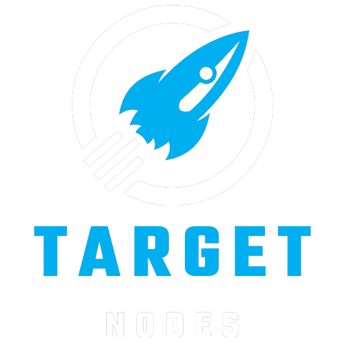

<div align="center">



<h1>TargetNodes Dashboard</h1>

**TargetNodes Dashboard is not only an explorer but also a wallet and more ... 🛠**

[](https://github.com/ping-pub/explorer/releases/latest)
[](https://github.com/ping-pub/explorer/blob/master/LICENSE)
[](https://github.com/ping-pub/explorer/actions/workflows/mainnet-deploy.yaml)
[](https://twitter.com/ping_pub)
[](https://discord.gg/CmjYVSr6GW)


</div>

`TargetNodes Dashboard` is a light explorer for Cosmos-based Blockchains.  https://targetnodes.com .

## What is the difference between TargetNodes explorer and other explorers? 

`TargetNodes Dashboard` is designed to explore blockchain data as real as possible, therefore there is no cache, no pre-processing. `TargetNodes Dashboard` only fetch data from Cosmos full node via LCD/RPC endpoints. We call it "Light Explorer".

We remain neutral to all chains, and we do not comment on their market prospects, technical risks, or investment risks.

## Why TargetNodes explorer use official/trusted third party public LCD/rpc server? 

There are two main reasons:

   - Trust, in a decentralized system, anything controlled by one entity cannot be trusted. So we decided to build with the community.
   - Limited resources: `TargetNodes Dashboard` will list hundreds of cosmos-based blockchains in the future, and it is impossible for our team to run validators or full nodes for all of them.


## Donation

Your donation will help us make better products. Thanks in advance.

 - Address for ERC20: USDC, USDT, ETH
```
0xC1120958Ddc44cF4feFAd6D69D6Ab427AF29A9C8
```

 - You can donate any token in the Cosmos ecosystem: [here](https://ping.pub/coffee)

> If you are an individual please do not donate more than $10, a cup of coffee means a lot to us.

#### Donations from project

- Point Network: 1000USDC and $1000 worth of POINT
- Bitsong: 50k BTSG
- IRISnet: 100k IRIS

## Stake With Us

You can hire us by submiting an issue and fund the issue on [TargetNodes Explorer](https://targetnodes.com/explorer)


## Contributors

Developers: @TargetNodes Team!

